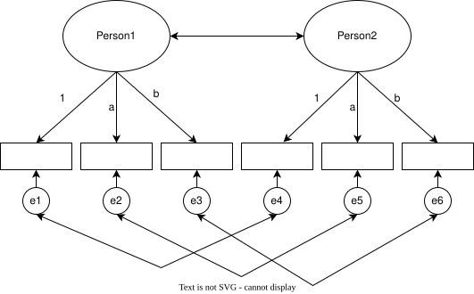

## Overview

In this assignment you will simulate dyadic data (a child and their mother) measuring optimism about the future. You will then estimate the correlation between child and mother optimism using **one** of two analytic strategies: Confirmatory Factor Analysis (CFA) **or** a Multilevel Model (MLM).

## Learning Objectives

- Simulate dyadic data with a known correlation structure
- Estimate the dyadic association using **one** of two approaches:
  - Fit a dyadic CFA and interpret the latent factor correlation, **or**
  - Fit a multilevel model to dyadic (pairwise) data and extract the intraclass correlation
- Compare your estimate against the known population parameter and reflect on your chosen approach

## Instructions

### Part 1: Data Simulation (25 points)

Generate a dataset of **300 child–mother dyads**. Each individual answers **four continuous items** measuring optimism about the future. The true correlation between child optimism and mother optimism is **ρ = 0.40**.

Use the simulation code below as your starting point. **Replace `YOUR_STUDENT_ID` with your actual student ID** so that every student has a unique dataset.

```{r}
#| echo: true
#| eval: false
library(tidyverse)

set.seed(YOUR_STUDENT_ID)
n <- 300

# --- Latent factors (correlated at r = 0.40) ---
eta_child <- rnorm(n)
eta_mother <- 0.40 * eta_child + sqrt(1 - 0.40^2) * rnorm(n)

# --- Factor loadings and residual correlation ---
lambda <- c(0.80, 0.75, 0.70, 0.65)
r_resid <- 0.25

# --- Generate observed items ---
items <- map(1:4, \(j) {
    e_child <- rnorm(n)
    e_mother <- r_resid * e_child + sqrt(1 - r_resid^2) * rnorm(n)

    tibble(
        "C{j}" := lambda[j] * eta_child + sqrt(1 - lambda[j]^2) * e_child,
        "M{j}" := lambda[j] * eta_mother + sqrt(1 - lambda[j]^2) * e_mother
    )
}) |>
    list_cbind()

# --- Add dyad ID and total scores ---
dyad_data <- items |>
    mutate(
        dyad_id = 1:n,
        child_total = (C1 + C2 + C3 + C4) / 4,
        mother_total = (M1 + M2 + M3 + M4) / 4,
        .before = 1
    )

dyad_data |> head(8)
```

::: {.callout-important title="Deliverables"}
1. Show the first few rows of your simulated dataset
2. Report descriptive statistics (mean and SD) for the child and mother total scores
3. Report the Pearson correlation between `child_total` and `mother_total`
:::

::: {.callout-tip title="AI Prompt for Descriptive Statistics"}
You are welcome to use AI tools to generate code for descriptive statistics and tables. When prompting, **provide context about the research, the data structure, and the purpose of the analysis**. Here is an example prompt you can adapt:

*"I am studying the association between child and mother optimism about the future in a sample of 300 child–mother dyads. My data frame is called `dyad_data` with one row per dyad. It contains `C1`–`C4` (4 child items), `M1`–`M4` (4 mother items), `child_total` (mean of C1–C4), `mother_total` (mean of M1–M4), and `dyad_id`. I need to report descriptive statistics (mean and SD) for both total scores and the Pearson correlation between them, because I want to establish a baseline estimate of the dyadic association before fitting a more complex model. Using tidyverse and gt or gtsummary, write R code to produce these tables and explain what the output means."*

**Tip:** Always include the variable names, the data frame name, the sample size, and a description of what the data represent. Asking the AI to **explain the output** helps you verify that the code is doing what you expect.
:::

::: {.callout-note title="A Note on Using AI"}
Using AI to generate code is perfectly fine for this assignment. However, you should understand what the code is doing. Once AI generates a solution, take the time to read through it, explore it, modify it, or try a different approach to accomplish the same task. The goal is to learn, not just to produce output.
:::

### Part 2: Dyadic Analysis — Choose ONE (60 points)

Choose **one** of the two options below. You will estimate the dyadic association using either a CFA or a Multilevel Model.

#### Option A: Confirmatory Factor Analysis

{width="80%"}

Fit a dyadic CFA in which child optimism and mother optimism are modeled as separate latent factors. You may use **lavaan or Mplus** (or both for extra credit).

##### lavaan

```{r}
#| echo: true
#| eval: false
library(lavaan)

cfa_model <- "
  # Latent factors
  child  =~ C1 + C2 + C3 + C4
  mother =~ M1 + M2 + M3 + M4

  # Latent correlation
  child ~~ mother

  # Correlated residuals across matching items
  C1 ~~ M1
  C2 ~~ M2
  C3 ~~ M3
  C4 ~~ M4
"

cfa_fit <- cfa(
    cfa_model,
    data = dyad_data,
    std.lv = TRUE
)

summary(cfa_fit, standardized = TRUE, fit.measures = TRUE)
```

##### Mplus

Save the data for Mplus:

```{r}
#| echo: true
#| eval: false
dyad_data |>
    select(C1:C4, M1:M4) |>
    write_delim("dyadic_optimism.dat", col_names = FALSE)
```

Then use the following input file (`dyadic_optimism_cfa.inp`):

```default
TITLE: Dyadic CFA - Child and Mother Optimism

DATA: FILE = "dyadic_optimism.dat";

VARIABLE:
  NAMES = C1 C2 C3 C4 M1 M2 M3 M4;
  USEVARIABLES = C1 C2 C3 C4 M1 M2 M3 M4;

MODEL:
  CHILD  BY C1* C2 C3 C4;
  MOTHER BY M1* M2 M3 M4;

  CHILD@1;
  MOTHER@1;

  CHILD WITH MOTHER;

  ! Correlated residuals across matching items
  C1 WITH M1;
  C2 WITH M2;
  C3 WITH M3;
  C4 WITH M4;

OUTPUT: STDYX CINTERVAL;
```

::: {.callout-important title="CFA Deliverables"}
1. Report your model syntax
2. Report model fit indices (χ², df, p-value, CFI, TLI, RMSEA, SRMR)
3. Report the standardized factor loadings for all 8 items
4. Report the estimated latent correlation between CHILD and MOTHER with its 95% confidence interval
:::

#### Option B: Multilevel Model

Estimate the dyadic association using a multilevel framework. The key idea is to restructure the data so that each row is one *person* (child or mother) nested within a *dyad*.

##### Step 1: Reshape to Long Format

```{r}
#| echo: true
#| eval: false
dyad_long <- dyad_data |>
    select(dyad_id, child_total, mother_total) |>
    pivot_longer(
        cols = c(child_total, mother_total),
        names_to = "role",
        values_to = "optimism"
    ) |>
    mutate(
        role = if_else(role == "child_total", "child", "mother"),
        role_code = if_else(role == "child", -0.5, 0.5)
    )

dyad_long |> head(8)
```

##### Step 2: Fit the Multilevel Model

Fit a model with optimism as the outcome, a fixed effect for role (to account for mean differences between children and mothers), and a random intercept for dyad:

```{r}
#| echo: true
#| eval: false
library(lmerTest)

mlm_fit <- lmer(
    optimism ~ role_code + (1 | dyad_id),
    data = dyad_long
)

summary(mlm_fit)
```

##### Step 3: Compute the ICC

Extract the variance components and compute the intraclass correlation:

```{r}
#| echo: true
#| eval: false
vc <- VarCorr(mlm_fit) |> as_tibble()

icc <- vc |>
    summarise(
        sigma2_dyad = vcov[grp == "dyad_id"],
        sigma2_residual = vcov[grp == "Residual"],
        icc = sigma2_dyad / (sigma2_dyad + sigma2_residual)
    )

icc |>
    mutate(across(everything(), \(x) round(x, 3))) |>
    print()
```

With exactly two members per dyad, the ICC from the random-intercept model is the estimate of the dyadic correlation. It represents the proportion of total variance in optimism that is shared between child and mother within the same dyad, assuming equal variances across roles.

::: {.callout-important title="MLM Deliverables"}
1. Report the variance components (between-dyad and within-dyad)
2. Report the ICC and interpret it as the dyadic correlation
3. Report the fixed effect for role and interpret it (do children and mothers differ in average optimism?)
:::

## Want to Go Deeper?

If you want to challenge yourself further, try one or more of the following:

1. **Complete the other approach**: If you chose the CFA, also fit the MLM (and vice versa). Compare the two estimates and discuss which is closer to the true value and why.
2. **Test measurement invariance**: Constrain the factor loadings to be equal across child and mother (i.e., `(L1-L4)` labels in Mplus, or `group` in lavaan). Compare the constrained and free models using a chi-square difference test.
3. **Both software packages**: Run the CFA in both lavaan and Mplus, and compare the results.

## Submission

Submit a **Word document** (`.docx`) or **PDF** containing:

1. Your R script or Quarto document with all code
2. Your Mplus input and output files (if using Mplus)
3. All tables and results organized by part

## Grading Rubric

| Component | Points |
|-----------|--------|
| Part 1: Data simulation and descriptive correlations | 25 |
| Part 2: Dyadic analysis (CFA **or** MLM) — model specification and interpretation | 75 |
| **Total** | **100** |
