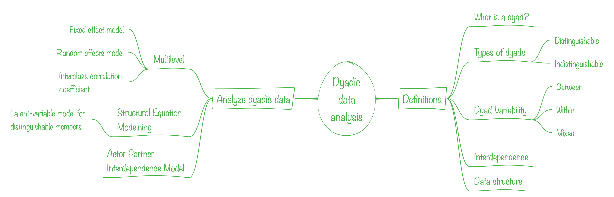
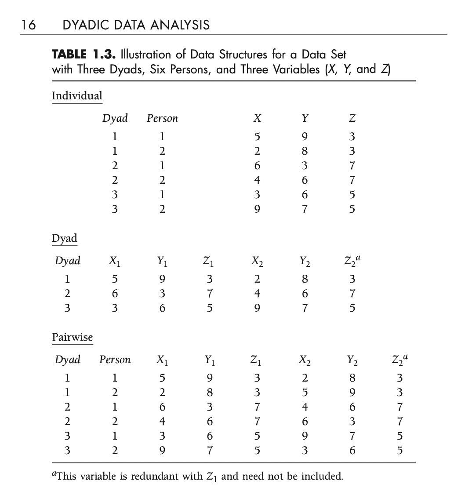
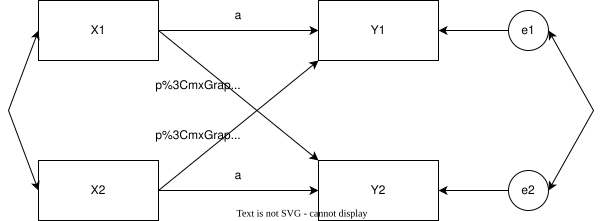
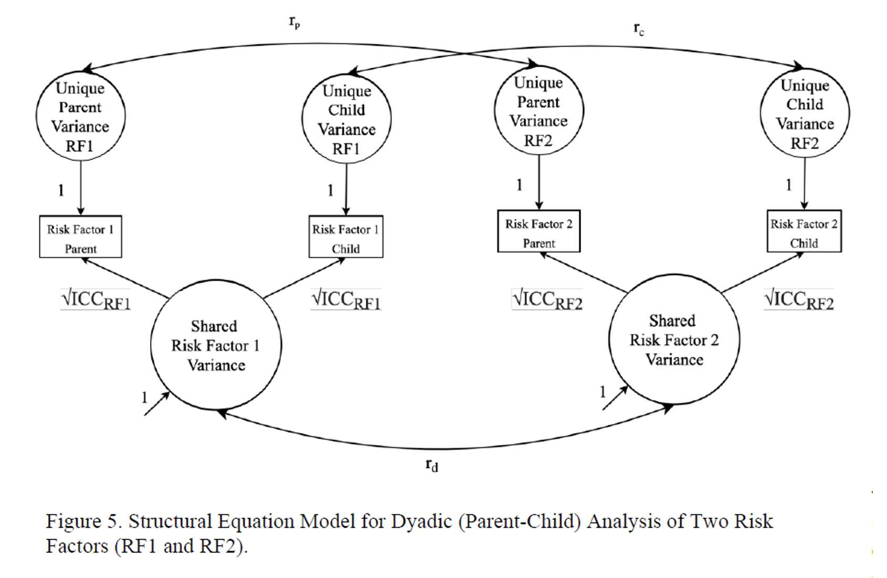

# Acknowledgment

Kenny, D. A., Kashy, D. A., & Cook, W. L. (2006). Dyadic data analysis. Guilford Press.

Visit: ["David Kenny web page"](http://www.davidakenny.net/dyad.htm)

## Map



## Definitions

The dyad is the unit of interpersonal interaction

-   Partners
-   Friends
-   Family
-   Co-workers

## Types of dyads

::: columns
::: {.column width="50%"}
### Distinguishable

-   There is a variable that can be used to differentiate between the two persons.

-   Husband and wife

-   First and second author

-   The advisor and PhD. Student
:::

::: {.column width="50%"}
### Indistinguishable

-   There is not a variable that can be used to differentiate between the two persons.

-   Twins

-   Best friends (mutually chosen)

-   Roommates
:::
:::

## Dyad Variability

::: columns
::: {.column width="50%"}
### Between

-   Time together
-   Family income
:::

::: {.column width="50%"}
### Within

-   Time using the car (only one car)
-   Gender (heterosexual couple)
:::
:::

## Mixed

-   Risk factor
-   Age

## Interdependence

### Non independence

"If the two scores from the two members of the dyad are non-independent, then those two scores are more similar to (or different from) from one another than are two scores from two people who are not members of the same dyad".

-   More similar within the dyad than the average

::: columns
::: {.column width="30%"}
🧟🧟️
:::
::: {.column width="30%"}
🧟️🧛️
:::
::: {.column width="30%"}
🧟🧛️
:::
:::
## Exercise

[Jamboard](https://jamboard.google.com/d/1C8A_jfudKn5ALtbtpJOqo0cTzkVdCp89PS-deuwQ76M/edit?usp=sharing)

## Data structure

{width="20%"}

## Type of models

-   Multilevel model
-   Structural Equation Model
-   Actor Partner Interdependence Model

# Multilevel model {background-color="#fde74c"}

```{r libraries}
#| echo: true
#| eval: false
library(tidyverse) # data cleaning
library(tidymodels) # to fit models
library(multilevelmod) # for mixed models
library(lme4) # for mixed models
library(reactable) # pretty tables
library(broom) # extract coefficients
library(broom.mixed) # extract coefficients
library(kableExtra) # tables
```

## Data set

::: r-fit-text
-   10 cohabiting heterosexual couples.

> Examine whether the contribution a person made to the household (a composite score based on financial contribution, as well as household labor) was associated with that person prediction for the relationship's future - specifically, the likelihood of marriage within the next 5 years, measured as a percentage.

> Cultural variation in the association.
:::

## The data

```{r data}
#| echo: true
#| eval: false
data_example <-
    tibble(
        Dyad = c(1, 1, 2, 2, 3, 3, 4, 4, 5, 5, 6, 6, 7, 7, 8, 8, 9, 9, 10, 10),
        Person = c(1, 2, 1, 2, 1, 2, 1, 2, 1, 2, 1, 2, 1, 2, 1, 2, 1, 2, 1, 2),
        Future = c(
            75,
            90,
            55,
            75,
            45,
            33,
            70,
            75,
            50,
            40,
            85,
            90,
            75,
            80,
            90,
            68,
            65,
            78,
            88,
            95
        ),
        Gender = c(
            -1,
            1,
            -1,
            1,
            -1,
            1,
            -1,
            1,
            -1,
            1,
            -1,
            1,
            -1,
            1,
            -1,
            1,
            -1,
            1,
            -1,
            1
        ),
        Contribution = c(
            -10,
            -5,
            0,
            10,
            -10,
            -15,
            5,
            15,
            0,
            -5,
            -10,
            20,
            -5,
            0,
            5,
            0,
            0,
            15,
            -15,
            5
        ),
        Culture = c(
            1,
            1,
            1,
            1,
            1,
            1,
            1,
            1,
            1,
            1,
            -1,
            -1,
            -1,
            -1,
            -1,
            -1,
            -1,
            -1,
            -1,
            -1
        )
    )

```

::: r-fit-text
Note: women = -1 and men = 1, American = 1 and Asian =-1. Contribution is about the sample mean (so the interaction among predictors can be readily interpreted).

```{r the-data}
#| echo: true
#| eval: false

library(reactable)
reactable(data_example)

``
`
:::

## Things we can do

-   Estimate the mean for future.
-   Using contribution, estimate if more contributions-more positive future
-   Using culture, we can estimate differences between groups.
-   Finally, the interaction between culture, contribution and future.

## Estimate a model using multiple regression

```{r, wrong-model}
#| echo: true
#| eval: false

lmm_wrong <- lm(Future ~ Contribution + Culture + Contribution*Culture,
                data=data_example) 

```

::: {style="font-size: 2.75em"}
```{r wrong-model-table}
#| echo: true
#| eval: false
library(gtsummary)
library(gt)
tbl_regression(lmm_wrong, intercept=T) %>% 
  bold_p(t = 0.10) %>%
  bold_labels() %>% 
  as_gt() %>% 
  tab_options(table.font.size = 25,
              table.width = pct(80))
  

`
``
:::

## Estimate a model using lmer (random effect)

```{r mixed-model}
#| echo: true
#| eval: false
lmm <- lmer(
    Future ~ Contribution + Culture + Contribution * Culture + (1 | Dyad),
    data = data_example
)

sjPlot::tab_model(
    lmm,
    CSS = list(
        css.table = "font-size:0.5em;"
    )
)

```

## Is the random effect significant?

```{r}
#| echo: true
#| eval: false
anova(lmm, lmm_wrong)
```

## Interclass correlation

How many random effects are in this model?

Two random factors:

-   The dyadic covariance (the variance of the intercept)
-   The error variance

## Compute Interclass Correlation Coefficient

```{r}
#| echo: true
#| eval: false
exp_rsq <- lmer(Future ~ (1 | Dyad), data = data_example)
summary(exp_rsq)

#255.5 / (255.5 + 82.3)

```

255.5 / (255.5 + 82.3) = 0.7563647

## R square

```{r}
#| echo: true
#| eval: false
library(MuMIn)
r.squaredGLMM(exp_rsq)

```


## Compute ICC

```{r}
#| echo: true
#| eval: false
summary(lmm)
```

## Compute ICC

```{r}
#| echo: true
#| eval: false

sjPlot::tab_model(
    lmm,
    CSS = list(
        css.table = "font-size:0.5em;"
    )
)
```

## How much variance is explained by the two predictors and the interaction?

```{r}
#| echo: true
#| eval: false
#1 - ((176.42 + 43.76) / (255.5 + 82.3))
```

1 - ((176.42 + 43.76) / (255.5 + 82.3)) = 34.8%

# Actor-Partner Interdependence Model (APIM) {background-color="#fde74c"}

## Actor-Partner Interdependence Model (APIM) {background-color="#9bc53d"}



## Actor-Partner Interdependence Model (APIM)

-   Pairwise data set
-   Distinguishable and indistinguishable
-   The trick for indistinguishable dyads is to constraint the parameters to be equal. It results in one actor effect and one partner effect.
-   The null model for dyadic analysis is not the all-free model. The null model should have constrained the means and variances of the actors.

# Structural Equation Model Approach {background-color="#fde74c"}

## Structural Equation Model Approach {background-color="#9bc53d"}


## Structural Equation Model Approach



## Example in Mplus

-   Open dyadic.inp

-   Data are on dyadic_data.dta

-   Run

-   What is the correlation between dyads?

## Aditional resources

-   ["How to Use the Actor-Partner Interdependence Model (APIM) To Estimate Different Dyadic Patterns in MPLUS: A Step-by-Step Tutorial"](https://www.tqmp.org/RegularArticles/vol12-1/p074/p074.pdf)

-   ["Quantitude"](https://quantitudepod.org/s3e13-the-actor-partner-interdependence-model/)

-   ["Shiny APIM"](https://davidakenny.shinyapps.io/APIM_MM/)
