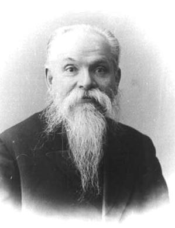
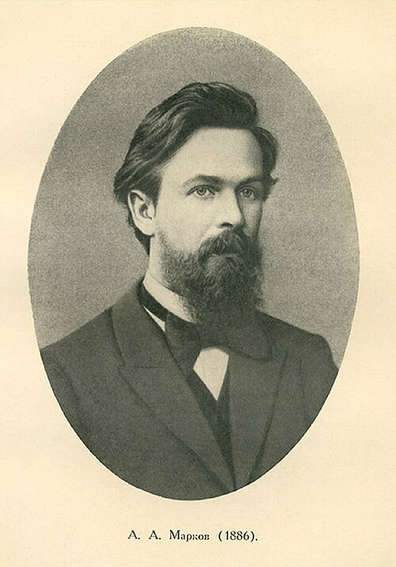
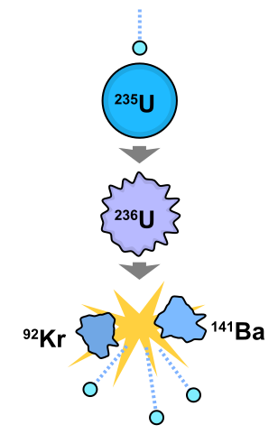
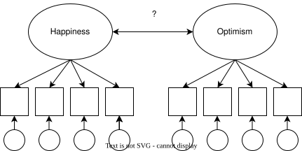

```{webr-r}
#| context: setup

library(dplyr)
library(ggplot2)
library(purrr)
library(tidyr)

chess <- tibble(
    Pieces = c(
        "PAWN", "PAWN", "PAWN", "PAWN",
        "PAWN", "PAWN", "PAWN", "PAWN",
        "BISHOP", "BISHOP",
        "KNIGHT", "KNIGHT",
        "ROOK", "ROOK",
        "QUEEN",
        "KING"
    )
)
```

# Can a computer solve probability? {background-color="#008000"}

## The Big Question {.smaller}

::: {.columns}
::: {.column width="60%"}
What if, instead of deriving complex mathematical formulas, we could just...

- Try it thousands of times
- Count how often something happens
- Estimate the probability from the results

This is the fundamental idea behind Monte Carlo simulation.
:::

::: {.column width="40%"}
::: {.callout-tip appearance="minimal"}
## The Core Insight

If you flip a coin 10 times, you might get 6 heads. That's not 50/50.

But if you flip it 1,000 times, the ratio will settle close to 50/50.

The more you try, the closer you get to the truth.
:::
:::
:::

## The Simplest Case: A Coin Flip {.smaller}

::: {.columns}
::: {.column width="50%"}

When you flip a coin 10 times, you might get 6 heads and 4 tails — obviously not 50/50.

But if you keep flipping:

- At first the ratio jumps all over the place
- After many flips, it slowly settles down
- After 100 flips: maybe 51 heads, 49 tails

:::
::: {.column width="50%"}

::: {.callout-note}
## The Law of Large Numbers

As the number of random trials increases, the average result will converge to the expected value.

First proven by Jacob Bernoulli in 1713, a foundational idea in probability for over 200 years.
:::
:::
:::

. . .

> But Bernoulli only proved this works for independent events. What about the real world, where almost everything depends on something else?

## Let's Try It with a Chess Set {.smaller}


```{webr-r}
chess
```

## What is the probability of picking the Queen? {.smaller}

::: {.panel-tabset}

### Formula

::: {.callout-note}
## Mathematical Solution

$$P(\text{Queen}) = \frac{\text{Number of Queens}}{\text{Total Chess Pieces}} = \frac{1}{16} = 0.0625$$

:::

This is easy, we can solve it with a formula. But what if the problem were harder?

### Monte Carlo Approach

::: {.callout-tip}
## Simulation Approach

Instead of calculating, we just:

1. Randomly pick a piece from the bag
2. Write down what we got
3. Put it back and repeat, many times
4. Count how often we got the Queen

As samples increase, our estimate approaches 1/16 = 0.0625.
:::

:::

## Let's Try: 10 Samples {.smaller}

First, how many samples do we want to try?

```{webr-r}
total_samples <- seq(1, 10, 1)
total_samples
```

Now we can simulate the process:

```{webr-r}
data <- map_dfr(total_samples, ~ slice_sample(chess, n = 1), .id = "sample")
data
```

## Results with 10 Samples {.smaller}

::: {.panel-tabset}

## Results

```{webr-r}
data |>
    count(Pieces) |>
    mutate(p = n / sum(n))
```

Did we get close to 0.0625? Probably not, 10 samples isn't enough.

## Formula

$$P(\text{Queen}) = \frac{1}{16} = 0.0625$$

:::

## Let's Try: 100 Samples {.smaller}

::: {.panel-tabset}

## Results

```{webr-r}
total_samples <- seq(1, 100, 1)

data <- map_dfr(total_samples, ~ slice_sample(chess, n = 1), .id = "sample")

data |>
    count(Pieces) |>
    mutate(p = n / sum(n))
```

Getting closer?

## Formula

$$P(\text{Queen}) = \frac{1}{16} = 0.0625$$

:::

## Let's Try: 500 Samples {.smaller}

::: {.panel-tabset}

## Results

```{webr-r}
total_samples <- seq(1, 500, 1)

data <- map_dfr(total_samples, ~ slice_sample(chess, n = 1), .id = "sample")

data |>
    count(Pieces) |>
    mutate(p = n / sum(n))
```

## Formula

$$P(\text{Queen}) = \frac{1}{16} = 0.0625$$

:::

## Watching Convergence {.smaller}

```{r}
#| echo: false
#| eval: true

library(tidyverse)

set.seed(2026)
theoretical_prob <- 1 / 16

chess_local <- tibble(
    Pieces = c(
        "PAWN", "PAWN", "PAWN", "PAWN",
        "PAWN", "PAWN", "PAWN", "PAWN",
        "BISHOP", "BISHOP",
        "KNIGHT", "KNIGHT",
        "ROOK", "ROOK",
        "QUEEN",
        "KING"
    )
)

sample_sizes <- c(10, 50, 100, 300, 500, 1000)
convergence_results <- tibble(sample_size = integer(), queen_prob = numeric())

for (size in sample_sizes) {
    samples <- map_dfr(seq(1, size, 1), ~ slice_sample(chess_local, n = 1), .id = "sample")

    queen_count <- samples |>
        filter(Pieces == "QUEEN") |>
        nrow()

    prob <- queen_count / size

    convergence_results <- convergence_results |>
        add_row(sample_size = size, queen_prob = prob)
}

convergence_results |>
    ggplot(aes(x = sample_size, y = queen_prob)) +
    geom_point(color = "#008000", size = 3) +
    geom_line(color = "#008000") +
    geom_hline(
        yintercept = theoretical_prob,
        linetype = "dashed",
        color = "#b3b3b3"
    ) +
    annotate(
        "text",
        x = max(sample_sizes) / 2,
        y = theoretical_prob + 0.01,
        label = "Theoretical probability (1/16 = 0.0625)",
        color = "#b3b3b3"
    ) +
    theme_minimal() +
    labs(
        x = "Sample Size",
        y = "Probability of Queen",
        title = "Monte Carlo Convergence to Theoretical Probability"
    )
```

More samples → closer to the true probability. That's the Law of Large Numbers in action.

. . .

As sample size increases, Monte Carlo estimates converge to theoretical probabilities (Law of Large Numbers). The computer does the hard work for us.

## Now Make It Harder: Two Bishops {.smaller}

::: {.panel-tabset}

### Formula

::: {.callout-note}
## Mathematical Solution

$$P(\text{Both Bishops}) = \frac{\binom{2}{2}}{\binom{16}{2}} = \frac{1}{120} \approx 0.0083$$

Where:

$\binom{2}{2}$ = Ways to choose 2 bishops from 2 bishops = 1

$\binom{16}{2}$ = Ways to choose 2 pieces from 16 pieces = 120
:::

### Monte Carlo Approach

::: {.callout-tip}
## Simulation Approach

We repeatedly sample 2 pieces from the chess set and count how often we get both bishops.

No formula needed,  just sampling and counting.
:::

:::

## Even Harder: KING Between Two PAWNs {.smaller}

::: {.panel-tabset}

## Formula

$$P(\text{PAWN, KING, PAWN}) = 
\frac{\binom{8}{2} \times \binom{1}{1}}{\binom{16}{3}} \times \frac{1}{3!} = \frac{28 \times 1}{560} \times \frac{1}{6} \approx 0.0083$$

Where:

- $\binom{8}{2}$ = Ways to choose 2 pawns from 8 pawns = 28
- $\binom{1}{1}$ = Ways to choose 1 king from 1 king = 1
- $\binom{16}{3}$ = Ways to choose 3 pieces from 16 pieces = 560
- $\frac{1}{3!}$ = Probability of specific order (PAWN, KING, PAWN)

## Monte Carlo

We repeatedly sample 3 pieces and check if they match the pattern:

1. First piece is PAWN
2. Second piece is KING
3. Third piece is PAWN

No need to derive the formula, just simulate and count!

:::

## Simulating the KING Pattern {.smaller}

```{webr-r}
total_samples <- seq(1, 1000, 1)

data <- map_dfr(total_samples, ~ slice_sample(chess, n = 3), .id = "sample")

data
```

## Results: KING Between Two PAWNs {.smaller}

```{webr-r}
data |>
  mutate(Position = row_number(), .by = sample) |>
  filter((Position == 1 & Pieces == "PAWN") &
         (Position == 2 & Pieces == "KING") &
         (Position == 3 & Pieces == "PAWN")) |>
  count(sample) |> arrange(desc(n)) |>
  count(n)
```

## The Pattern So Far {.smaller}

::: {.columns}
::: {.column width="50%"}
With Formulas:

- Exact answers  
- Require complete mathematical specification 
- Get very complex very fast  
- Sometimes impossible for realistic problems  

:::

::: {.column width="50%"}
With Monte Carlo:

- Approximate answers  
- Just simulate and count 
- Handle any level of complexity  
- Accuracy increases with more samples 
:::
:::

. . .

::: {.callout-important}
As sample size increases, Monte Carlo estimates converge to theoretical probabilities (Law of Large Numbers). The computer does the hard work for us.
:::


# A Math Dispute That Changed Everything {background-color="#fde74c"}

## Russia, 1905 {.smaller}

::: {.columns}
::: {.column width="50%"}

{width="45%"}
{width="45%"}
:::

::: {.column width="50%"}
::: {.callout}
## The Two Sides

*Pavel Nekrasov*, *The Tsar of Probability*

- Religious, powerful, defended the status quo  
- Argued math could explain free will  

*Andrey Markov*, *Andrey the Furious*

- Atheist, rigorous, had no patience for sloppy reasoning  
- Called Nekrasov's work "an abuse of mathematics"  
:::
:::
:::

## The Argument: Independence and Free Will {.smaller}

Their dispute centered on the Law of Large Numbers, the same idea we just used with chess pieces.

::: {.columns}
::: {.column width="50%"}
Nekrasov's reasoning:
1. Bernoulli proved the Law of Large Numbers works for independent events  
2. Social statistics (marriage rates, crime rates) follow the Law of Large Numbers  
3. Therefore, the decisions behind them must be independent
4. Independent decisions = free will  

> *"Free will is not just philosophical, it's measurable!"*
:::

::: {.column width="50%"}
Markov's response:

> Just because we see convergence doesn't mean the events are independent.

He set out to prove that dependent events could also follow the Law of Large Numbers.

He needed an example where one event clearly depends on what came before...
:::
:::

## Markov's Counterattack: Poetry as Data {.smaller}

::: {.columns}
::: {.column width="60%"}

Markov turned to *Eugene Onegin* by *Alexander Pushkin*, a masterpiece of Russian literature.

He took the first 20,000 letters, stripped out punctuation and spaces, and analyzed them:

- 43% vowels, 57% consonants
- If letters were independent, vowel-vowel pairs should appear 18% of the time (0.43 × 0.43)
- But he found vowel-vowel pairs only 6% of the time

The letters were clearly dependent, what comes next depends on what came before.
:::

::: {.column width="40%"}
::: {.callout-note}
## The Test

If Markov could show that these dependent letters still followed the Law of Large Numbers, he would shatter Nekrasov's argument.

And that's exactly what he did.
:::
:::
:::

## The First Markov Chain {.smaller}

::: {.columns}
::: {.column width="60%"}

Markov built a prediction machine with just two states:

1. Start at a vowel or consonant
2. Look up the transition probability to the next state
3. Generate a random number to decide what happens
4. Repeat

After many steps, the ratio converged to 43% vowels and 57% consonants, exactly what he counted by hand.

Dependent events following the Law of Large Numbers.
:::

::: {.column width="40%"}
::: {.callout-important}
## Markov Chains
A sequence of events where the probability of each event depends only on the current state.


Try it: [Markov Chain Visualization](https://setosa.io/blog/2014/07/26/markov-chains/)
:::
:::
:::

## "Free Will Is Not Necessary to Do Probability" {.smaller}

In fact, independence isn't even necessary. With Markov chains, he found a way to do probability with dependent events.

This should have been a huge breakthrough, because in the real world, almost everything depends on something else:

- Weather tomorrow depends on conditions today
- How a disease spreads depends on who is infected now
- The behavior of particles depends on particles around them

. . .

But Markov himself didn't seem to care much about applications.

> *"I am concerned only with questions of pure analysis. I refer to the question of applicability with indifference."*

Little did he know what would come next.

# From Solitaire to the Atomic Bomb {background-color="#008000"}

## Enrico Fermi's Innovation (1930s) {.smaller}

::: {.columns}
::: {.column width="60%"}
::: {.incremental}
- Pioneered "statistical sampling" to model neutron diffusion
- Used simple probabilistic methods before modern computers
- Created the foundation for particle physics simulations
:::
:::

::: {.column width="40%"}
{.rounded-corners}
:::
:::

## Ulam's Solitaire Moment (1946) {.smaller}

::: {.columns}
::: {.column width="55%"}

In January 1946, mathematician Stanislaw Ulam was struck by severe encephalitis. During his long recovery, he played countless games of Solitaire.

One question kept nagging him: *What are the chances that a randomly-shuffled game can be won?*

With 52 cards, there are 52! possible arrangements, about 8 × 10^67^. Solving this analytically was hopeless.

Then Ulam had a flash of insight: *What if I just play hundreds of games and count how many can be won?*
:::

::: {.column width="45%"}
::: {.callout-tip}
## The Monte Carlo Insight

This is exactly what we did with chess pieces!

Instead of deriving a formula, just:

1. Generate random scenarios
2. Check the outcome
3. Repeat many times
4. Count the results

The key difference: now he wanted to apply this to nuclear physics.
:::
:::
:::

## The Manhattan Project Connection {.smaller}

::: {.columns}
::: {.column width="50%"}

Back at Los Alamos, scientists were trying to figure out how neutrons behave inside a nuclear core.

A neutron can:

- Scatter off an atom and keep traveling
- Get absorbed or leave the system
- Cause fission, splitting a uranium atom and releasing two or three more neutrons

Each step depends on the previous one, it's a Markov chain.

Ulam shared his Solitaire idea with *John von Neumann*, who immediately saw its power: simulate the chain on a computer.
:::

::: {.column width="50%"}

:::
:::

## The Birth of Monte Carlo {.smaller}

::: {.columns}
::: {.column width="60%"}

Von Neumann and Ulam ran their neutron simulations on the ENIAC, one of the world's first electronic computers.

They tracked the multiplication factor *k*:

- *k* < 1: reaction dies down
- *k* = 1: self-sustaining chain reaction
- *k* > 1: exponential growth — a bomb

The method needed a name. Ulam's uncle was a gambler, and the random sampling reminded him of the Monte Carlo Casino in Monaco.

The Monte Carlo method was born.
:::

::: {.column width="40%"}
::: {.callout-note}
## The MANIAC Computer (1953)

Mathematical Analyzer, Numerical Integrator, And Computer

- 70,000 multiplications per second (modern computers: billions)
- Arianna Rosenbluth's contribution often overlooked
:::
:::
:::

## Key Milestones After the Bomb {.smaller}

::: {.columns}
::: {.column width="50%"}

1955, *RAND Corporation* publishes *A Million Random Digits*, the first resource for random number generation

1970, *W. Keith Hastings* generalizes the Metropolis algorithm, enabling Bayesian applications

> "A lot of statisticians were not oriented toward computing. They take these theoretical courses, crank out theoretical papers, and some of them want an exact answer.*
:::

::: {.column width="50%"}
1991, *Johnson & Gastwirth* use Bayesian Monte Carlo to show why universal HIV screening would be counterproductive, even highly sensitive tests generate many false positives for rare diseases

Today, *Hamiltonian Monte Carlo* powers modern Bayesian software like Stan and PyMC, making complex statistical inference accessible to researchers everywhere
:::
:::

# {background-image="img/map.png" background-size="100%"}

# What Is Monte Carlo Simulation? {background-color="#fde74c"}

## Putting It All Together {.smaller}

::: {.columns}
::: {.column width="60%"}
Monte Carlo simulation is a computational method that:

- Uses repeated random sampling to obtain numerical results  
- Approximates solutions to problems too complex for formulas  
- Generates countless "what-if" scenarios based on probability distributions  
- Works by leveraging the Law of Large Numbers, more trials → better estimates
:::

::: {.column width="40%"}
::: {.callout-tip appearance="minimal"}
## The Three Steps

1. Generate random inputs from probability distributions

2. Process those inputs through your model

3. Aggregate statistics from many iterations
:::
:::
:::

## Einstein Was Wrong (Sort of) {.smaller}

> *"Insanity is doing the same thing over and over and expecting different results."* Albert Einstein

. . .

But in Monte Carlo simulations, we *do* the same thing over and over and *get* different results, that's the whole point!

- Each simulation run produces different random outcomes
- The collective results reveal the underlying probability distribution
- The more simulations we run, the closer we get to the truth

. . .

This is not insanity, it's science.


# Building More Complex Simulations {background-color="#008000"}

## From Chess Pieces to Data Generation {.smaller}

So far we've sampled from a bag of chess pieces. But we can simulate anything:

- Continuous variables (heights, test scores, income)
- Binary outcomes (treatment/control, yes/no)
- Relationships between variables
- Entire regression models

Let's build up, step by step.

## Simulating a Continuous Variable {.smaller}

```{webr-r}
x <- rnorm(300, mean = 0, sd = 1)
x
```

## Visualizing the Distribution {.smaller}

```{webr-r}
ggplot(as.data.frame(x), aes(x)) + 
  geom_histogram(fill = "#008000") + 
  theme_minimal()
```

## Simulating a Binary Variable {.smaller}

```{webr-r}
y <- rbinom(300, 1, .5)
y
```

## Visualizing the Binary Variable {.smaller}

```{webr-r}
ggplot(as.data.frame(y), aes(factor(y))) + 
  geom_bar(aes(y = after_stat(prop), group = 1), fill = "#008000") +
  scale_y_continuous(labels = scales::percent) +
  labs(x = "y") +
  theme_void()
```

## Creating a Relationship {.smaller}

Now let's create a variable z that depends on both x and y:

$$z = 1.5 + 0.8 \times y + x$$

```{webr-r}
z <- 1.5 + 0.8 * (y) + x
z
```

We know the true effect of y on z is 0.8. Can we recover it?

## Recovering the True Effect {.smaller}

```{webr-r}
lm(z ~ y)
```

With all 300 observations, we should get close to 0.8.

## But What Happens with Smaller Samples? {.smaller}

```{webr-r}
data <- tibble(x, y, z)

sample_1 <- slice_sample(data, prop = 0.1)
sample_2 <- slice_sample(data, prop = 0.1)
sample_3 <- slice_sample(data, prop = 0.1)
```

## Each Sample Gives a Different Answer {.smaller}

```{webr-r}
lm(z ~ y, data = sample_1)
lm(z ~ y, data = sample_2)
lm(z ~ y, data = sample_3)
```

. . .

Different samples → different estimates. This is sampling variability, and Monte Carlo helps us understand it.

## Let's Do This 60 Times {.smaller}

```{webr-r}
several_samples <- map(seq(1, 60, 1), ~ slice_sample(data, prop = 0.1))
several_samples
```

## Run a Regression on Each Sample {.smaller}

```{webr-r}
several_regressions <- map(several_samples, ~ lm(z ~ y, data = .))
several_regressions
```

## Extract the Coefficients {.smaller}

```{webr-r}
several_regressions <- map(several_samples, 
                           ~ lm(z ~ y, data = .)[[1]][[2]])
several_regressions
```

## The Sampling Distribution of Effects {.smaller}

```{webr-r}
all_effects <- 
  several_regressions |> 
  bind_cols() |> 
  pivot_longer(everything(), 
               names_to = "Sample",
               values_to = "Coef")

all_effects
```

## Visualizing the Sampling Distribution {.smaller}

```{webr-r}
avg <- mean(all_effects$Coef)
ggplot(all_effects, aes(Coef)) + 
  geom_histogram(fill = "#fde74c") +
  theme_minimal() + 
  geom_vline(xintercept = avg, linetype = "dashed", color = '#008000') +
  geom_vline(xintercept = 0.8, linetype = "dotted", color = '#ff5252')
```

The dashed green line is our average estimate. The dotted red line is the true effect (0.8).

## How Often Did We Underestimate? {.smaller}

```{webr-r}
all_effects |> filter(Coef < 0.8)
```

## How Often Did We Find No Effect or a Negative Effect? {.smaller}

```{webr-r}
all_effects |> filter(Coef <= 0)
```

. . .

This is the essence of statistical power: *how often will our study detect an effect that truly exists?*


# Real-World Applications of Monte Carlo {background-color="#008000"}

## Research Design Applications {.smaller}

::: {.columns}
::: {.column width="50%"}
Monte Carlo simulations help researchers make informed decisions about:

- Required sample sizes
- Minimum detectable effects
- Statistical power
- Impact of missing data
- Measurement reliability

:::

::: {.column width="50%"}

:::

:::

## Application 1: Sample Size Determination {.smaller}

::: {.panel-tabset}

### Scenario

<div class="mc-flex">
<div class="mc-content" style="width: 55%;">

**Question:**

*What sample size do we need to detect a correlation of 0.5 between happiness and optimism?*

Fixed Parameters:

- Target correlation: 0.5  
- Desired power: 0.8 (80%)  
- Alpha level: 0.05  
- Factor loading: 0.8 (reliability of measures)  
- Missing data: none  

</div>
<div class="mc-box" style="width: 40%;">
<h4>Monte Carlo Approach</h4>
<ol>
<li>Simulate data with the target correlation</li>
<li>Run tests with increasing sample sizes</li>
<li>Calculate power at each sample size</li>
<li>Find minimum sample size with 80% power</li>
</ol>
</div>
</div>

### Code

```{r}
#| echo: true
#| eval: false

correlation <- 0.5
alpha <- 0.05
trials <- 1000

results <- tibble(n = seq(10, 100, by = 5)) |>
  mutate(
    sims = map(n, \(n) {
      tibble(trial = 1:trials) |>
        mutate(
          data = map(trial, \(t) {
            MASS::mvrnorm(n, mu = c(0, 0),
                          Sigma = matrix(c(1, correlation, correlation, 1), 2, 2)) |>
              as_tibble(.name_repair = ~c("happiness", "optimism"))
          }),
          p_value = map_dbl(data, \(d) cor.test(d$happiness, d$optimism)$p.value)
        )
    }),
    achieved_power = map_dbl(sims, \(s) mean(s$p_value < alpha))
  ) |>
  select(n, achieved_power)
```

### Results

<div class="mc-flex center">
<div style="width: 50%;">

```{r}
#| echo: false
#| eval: true

library(tidyverse)

tibble(
  n = c(10, 15, 20, 25, 30, 35, 40, 45),
  achieved_power = c(0.22, 0.34, 0.46, 0.58, 0.69, 0.76, 0.83, 0.88)
) |>
  ggplot(aes(x = n, y = achieved_power)) +
  geom_line(color = "#008000", linewidth = 1.2) +
  geom_point(color = "#008000", size = 3) +
  geom_hline(yintercept = 0.8, linetype = "dashed", color = "#fde74c", linewidth = 1) +
  annotate("text", x = 20, y = 0.83, label = "Target Power (80%)", color = "#444444") +
  geom_vline(xintercept = 40, linetype = "dashed", color = "#ff5252", linewidth = 1) +
  annotate("text", x = 45, y = 0.5, label = "Required n = 40", color = "#444444") +
  theme_minimal() +
  labs(
    x = "Sample Size",
    y = "Statistical Power",
    title = "Power Analysis Results"
  ) +
  theme(
    plot.title = element_text(face = "bold"),
    axis.title = element_text(face = "bold")
  )
```

</div>
<div class="mc-box-accent" style="width: 45%;">

Conclusion:
To detect a correlation of 0.5 with 80% power:

- Minimum required sample size: 40 participants- With this sample size, we have an 83% chance of detecting the effect if it exists
- Reliability of our measures (0.8) helps reduce the needed sample size
- Without Monte Carlo, we might have overestimated the required sample size

</div>
</div>

:::

## Application 2: Minimum Detectable Effect {.smaller}

::: {.panel-tabset}

### Scenario

<div class="mc-flex">
<div class="mc-content" style="width: 55%;">

**Question:**

*What's the smallest correlation between happiness and optimism we can reliably detect with our sample?*

Fixed Parameters:

- Sample size: 40 participants (fixed by budget constraints)  
- Desired power: 0.8 (80%)  
- Alpha level: 0.05 
- Factor loading: 0.7 (reliability of measures)  
- Missing data: 5% (expected attrition)  

</div>
<div class="mc-box" style="width: 40%;">
<h4>Monte Carlo Approach</h4>
<ol>
<li>Simulate data with various correlations</li>
<li>Account for 5% missing data in simulations</li>
<li>Adjust for measurement reliability (0.7)</li>
<li>Find minimum correlation with 80% power</li>
</ol>
</div>
</div>

### Code

```{r}
#| echo: true
#| eval: false

alpha <- 0.05
trials <- 1000
effective_n <- floor(40 * (1 - 0.05))
factor_loading <- 0.7

results <- tibble(correlation = seq(0.1, 0.9, by = 0.05)) |>
  mutate(
    adjusted_r = correlation * factor_loading^2,
    sims = map(adjusted_r, \(r) {
      tibble(trial = 1:trials) |>
        mutate(
          data = map(trial, \(t) {
            MASS::mvrnorm(effective_n, mu = c(0, 0),
                          Sigma = matrix(c(1, r, r, 1), 2, 2)) |>
              as_tibble(.name_repair = ~c("happiness", "optimism"))
          }),
          p_value = map_dbl(data, \(d) cor.test(d$happiness, d$optimism)$p.value)
        )
    }),
    achieved_power = map_dbl(sims, \(s) mean(s$p_value < alpha))
  ) |>
  select(correlation, achieved_power)
```

### Results

<div class="mc-flex center">
<div style="width: 50%;">

```{r}
#| echo: false
#| eval: true

tibble(
  correlation = c(0.1, 0.15, 0.2, 0.25, 0.3, 0.35, 0.4, 0.45, 0.5),
  achieved_power = c(0.12, 0.18, 0.28, 0.42, 0.58, 0.7, 0.79, 0.88, 0.94)
) |>
  ggplot(aes(x = correlation, y = achieved_power)) +
  geom_line(color = "#008000", linewidth = 1.2) +
  geom_point(color = "#008000", size = 3) +
  geom_hline(yintercept = 0.8, linetype = "dashed", color = "#fde74c", linewidth = 1) +
  annotate("text", x = 0.25, y = 0.83, label = "Target Power (80%)", color = "#444444") +
  geom_vline(xintercept = 0.4, linetype = "dashed", color = "#ff5252", linewidth = 1) +
  annotate("text", x = 0.45, y = 0.5, label = "Minimum r = 0.4", color = "#444444") +
  theme_minimal() +
  labs(
    x = "Correlation Coefficient",
    y = "Statistical Power",
    title = "Minimum Detectable Effect Analysis"
  ) +
  theme(
    plot.title = element_text(face = "bold"),
    axis.title = element_text(face = "bold")
  )
```

</div>
<div class="mc-box" style="width: 40%;">

Conclusion:
With 40 participants and 5% missing data:

- We can reliably detect correlations of r = 0.4 or larger- Smaller correlations (r < 0.4) will be harder to detect  
- The 5% missing data reduces our effective sample size  
- Measurement reliability of 0.7 further attenuates the detectable effect  
- Researchers should focus on effects of at least medium size  

</div>
</div>

:::

## Application 3: Power Analysis {.smaller}

::: {.panel-tabset}

### Scenario

<div class="mc-flex">
<div class="mc-content" style="width: 55%;">

**Question:**

*What is our statistical power to detect a correlation of 0.3 between happiness and optimism?*

Fixed Parameters:

- Sample size: 60 participants (already collected)  
- Alpha level: 0.05  
- Target correlation: 0.3 (small-to-medium effect)  
- Factor loading: 0.62 (measured reliability)  
- Missing data: 10% (actual attrition)  

</div>
<div class="mc-box" style="width: 40%;">
<h4>Monte Carlo Approach</h4>
<ol>
<li>Simulate 1000+ datasets with our parameters</li>
<li>Apply 10% missing data pattern</li>
<li>Adjust for measurement reliability (0.62)</li>
<li>Calculate percentage of significant results</li>
</ol>
</div>
</div>

### Code

```{r}
#| echo: true
#| eval: false

alpha <- 0.05
trials <- 1000
effective_n <- floor(60 * (1 - 0.10))
adjusted_r <- 0.3 * 0.62^2

results <- tibble(trial = 1:trials) |>
  mutate(
    data = map(trial, \(t) {
      MASS::mvrnorm(effective_n, mu = c(0, 0),
                    Sigma = matrix(c(1, adjusted_r, adjusted_r, 1), 2, 2)) |>
        as_tibble(.name_repair = ~c("happiness", "optimism"))
    }),
    p_value = map_dbl(data, \(d) cor.test(d$happiness, d$optimism)$p.value)
  )

achieved_power <- mean(results$p_value < alpha)
```

### Results

<div class="mc-flex center">
<div style="width: 50%;">

```{r}
#| echo: false
#| eval: true

set.seed(42)
p_values <- rbeta(1000, 0.5, 3)
p_significant <- sum(p_values < 0.05)

tibble(p_value = p_values) |>
  ggplot(aes(x = p_value)) +
  geom_histogram(bins = 30, fill = "#008000", alpha = 0.8) +
  geom_vline(xintercept = 0.05, linetype = "dashed", color = "#ff5252", linewidth = 1) +
  annotate("text", x = 0.07, y = 50, label = "α = 0.05", color = "#444444") +
  annotate("rect", xmin = 0, xmax = 0.05, ymin = 0, ymax = Inf, 
           fill = "#fde74c", alpha = 0.2) +
  annotate("text", x = 0.5, y = 150, 
           label = paste0(round(100 * p_significant/1000), "% significant results"), 
           color = "#444444", size = 5) +
  theme_minimal() +
  labs(
    x = "p-value",
    y = "Frequency",
    title = "Distribution of p-values across 1000 simulations"
  ) +
  theme(
    plot.title = element_text(face = "bold"),
    axis.title = element_text(face = "bold")
  )
```

</div>
<div class="mc-box" style="width: 40%;">

Conclusion:
For our study with 60 participants:

- Statistical power is approximately 51% to detect r = 0.3
- This is below the conventional 80% power threshold
- The 10% missing data significantly reduced our power
- Measurement reliability (0.62) further attenuated the effect
- Recommendations:
  - Use more reliable measures in future studies
  - Implement strategies to reduce missing data
  - Consider focusing on larger effect sizes

</div>
</div>

:::

# Monte Carlo in Mplus {background-color="#008000"}

## The Model {.smaller}

::: {.columns}
::: {.column width="50%"}

We want to estimate power for a structural equation model:

- A latent factor F measured by 4 continuous items (x1–x4)
- F predicts an observed outcome y

**Population Parameters:**

- Factor loadings: .7, 0.8, 0.7, 0.9
- Regression of y on F: 0.5
- Factor variance: 1.0
- Residual variances: 1 - loadings^2 for all items and y
:::

::: {.column width="50%"}
::: {.callout-note}
## The Question

**Question:**

With a sample of n = 40, do we have enough power to detect:

- The regression effect of `F` on `y` (0.3)?

**Answer:**

Mplus can answer this using its built-in `MONTECARLO:` command, no external dataset needed.
:::
:::
:::


## The Mplus Monte Carlo Syntax {.smaller}

::: {.panel-tabset}

### Input File

```default
TITLE:
Monte Carlo Power Analysis:
Latent Factor (4 indicators) predicting an observed outcome

MONTECARLO:
  NAMES = x1-x4 y;
  NOBSERVATIONS = 40;
  NREPS = 1000;
  SEED = 2026;

MODEL POPULATION:
  f BY x1*.7 x2*.8 x3*.7 x4*.9;
  f@1;
  y ON f*.3;
x1*.51;
x2*.36;
x3*.51;
x4*.19;
  y*.6;

MODEL:
  f BY x1* x2 x3 x4;
  f@1;
  y ON f*;

OUTPUT: TECH9;
```

### Key Sections

::: {.callout-note}
## MONTECARLO:

- `NAMES = x1-x4 y;` — the variables in the simulated datasets
- `NOBSERVATIONS = 40;` — sample size per replication
- `NREPS = 1000;` — number of replications (more = more precise power estimate)
- `SEED = 2026;` — for reproducibility
:::

::: {.callout-note}
## MODEL POPULATION:

The true data-generating process. Values after `*` are the population parameters:

- `f BY x1*.7 x2*.8 x3*.7 x4*.9;` factor loadings
- `f@1;` factor variance fixed at 1
- `y ON f*.3;` regression coefficient
- `x1*.51; x2*.36; x3*.51; x4*.19;` residual variances (1 minus loading squared)
- `y*.6;` residual variance of the outcome
:::

::: {.callout-note}
## MODEL:

The analysis model fitted to each simulated dataset. Values after `*` are starting values.

- `f BY x1* x2 x3 x4;` freely estimate all loadings
- `f@1;` fix factor variance at 1
- `y ON f*;` freely estimate the regression path
:::

:::

## Reading the Mplus Output {.smaller}

::: {.panel-tabset}

### Key Output Table

After running, Mplus produces a table like this:

```default
                           ESTIMATES            S. E.   M. S. E.  95%  % Sig
              Population   Average   Std. Dev.  Average           Cover Coeff
 F BY
  X1             1.000     0.6865     0.1438    0.1411   0.1189   0.401 0.999
  X2             1.000     0.7856     0.1371    0.1356   0.0648   0.644 0.999
  X3             1.000     0.6823     0.1480    0.1414   0.1228   0.402 0.996
  X4             1.000     0.8835     0.1311    0.1301   0.0308   0.823 1.000

 Y ON
  F              0.000     0.2949     0.1328    0.1313   0.1046   0.379 0.621

 Residual Variances
  X1             0.500     0.4733     0.1308    0.1235   0.0178   0.884 0.998
  X2             0.500     0.3376     0.1106    0.1049   0.0386   0.574 0.966
  X3             0.500     0.4798     0.1319    0.1246   0.0178   0.899 0.999
  X4             0.500     0.1801     0.1014    0.0970   0.1126   0.134 0.522
  Y              0.500     0.5697     0.1331    0.1304   0.0226   0.951 1.000
```

### Interpreting Columns

- **Population** the true parameter value you specified
- **Average** mean of estimates across 1000 replications (should be close to Population if unbiased)
- **Std. Dev.** standard deviation of estimates across replications (empirical SE)
- **S.E. Average** mean of the model-based standard errors (should be close to Std. Dev.)
- **M.S.E.** mean squared error (combines bias and variance)
- **95% Cover**  proportion of replications where the 95% CI contains the true value (should be ~0.95)
- **% Sig Coeff**  proportion of replications where the parameter is significant (p < .05). This is the **power** estimate!

### What Do the Results Tell Us?

With n = 40:

- Regression `y` ON `F`: % Sig ≈ 0.621 (below the 0.80 threshold), and coverage is only 0.379

Conclusion: n = 40 is insufficient to detect the regression effect. We need a larger sample or ?.

:::

## The Monte Carlo Workflow in Mplus {.smaller}

::: {.columns}
::: {.column width="50%"}

1. Specify the population model with the effect sizes you expect
2. Choose a starting sample size
3. Run the Monte Carlo simulation
4. Check the power column for your key parameters
5. If power < 0.80, increase NOBSERVATIONS
6. If power > 0.95, consider whether a smaller n would suffice
7. Repeat until you find the minimum n that gives adequate power
:::

::: {.column width="50%"}
::: {.callout-tip}
## Tips

- Always set NREPS to at least 1000 for stable power estimates
- Use SEED for reproducibility
- Check the Cover column — values far from 0.95 suggest model problems
- Check that Average ≈ Population — large deviations indicate bias
- The Mplus `.inp` file for this example is available in the `montecarlo/` folder: `power_sem.inp`
:::
:::
:::

# Wrapping Up {background-color="#fde74c"}

## Monte Carlo for Research Planning: Summary {.smaller}

<div class="mc-flex">
<div class="mc-content" style="width: 60%;">

<h3>Key Benefits:</h3>

<ol>
<li>Realistic planning: Accounts for real-world complexities like:
   <ul>
   <li>Missing data</li>
   <li>Measurement error</li>
   <li>Complex statistical models</li>
   </ul>
</li>
<li>Flexibility: Can simulate any research design and analysis</li>
<li>Transparency: Makes assumptions explicit and testable</li>
<li>Cost-effective: Optimizes resource allocation before data collection</li>
<li>Reduced risk: Identifies potential issues before they happen</li>
</ol>

</div>
<div class="mc-box" style="width: 35%;">

<h3>Practical Workflow:</h3>

<ol>
<li>Define research questions and hypotheses</li>
<li>Specify expected parameters and constraints</li>
<li>Program Monte Carlo simulations</li>
<li>Run simulations for various scenarios</li>
<li>Visualize and interpret results</li>
<li>Make informed research design decisions</li>
<li>Document simulation-based decisions</li>
</ol>

</div>
</div>

<div class="mc-box-highlight">
<h3>The Monte Carlo approach transforms research planning from an educated guess into a data-driven decision process</h3>
</div>

## The Bigger Picture {.smaller}

::: {.columns}
::: {.column width="50%"}

What started as a math dispute in 1905 Russia became one of the most important computational methods ever invented:

- Markov showed you can do probability with dependent events
- Ulam & von Neumann turned it into a tool for solving impossible problems
- Today it powers everything from drug trials to climate models to AI

:::
::: {.column width="50%"}

::: {.callout-note}
## Further Watching

The historical narrative in this lecture draws from the Veritasium video ["The Surprisingly Satisfying Math Behind Markov Chains"](https://www.youtube.com/watch?v=bM5T1HrMKD0) — highly recommended for a deeper dive into the story.

Try the [Markomposition](http://mariechatfield.com/markomposition/) tool to see Markov chains generate text!
:::
:::
:::

. . .

> "It is still an unending source of surprise for me to see how a few scribbles on a blackboard could change the course of human affairs." — Stanislaw Ulam
